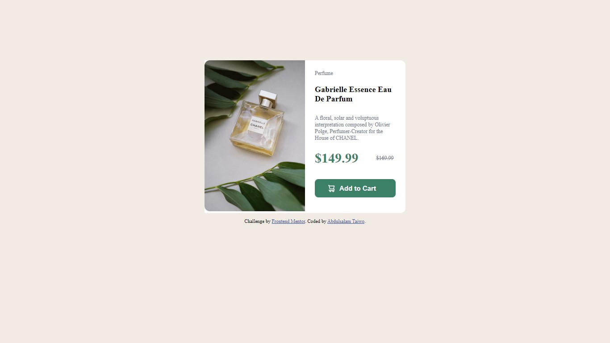

# Frontend Mentor - Product preview card component

## Welcome! 👋

Thanks for checking out this front-end coding challenge.

[Frontend Mentor](https://www.frontendmentor.io) challenges help you improve your coding skills by building realistic projects.

**To do this challenge, you need a basic understanding of HTML and CSS.**

## The challenge

Users should be able to:

- View the optimal layout depending on their device's screen size
- See hover and focus states for interactive elements

### Built with

- Semantic HTML5 markup
- CSS custom properties
- Flexbox
- CSS Grid
- Mobile-first workflow
- [React](https://reactjs.org/) - JS library
- [Next.js](https://nextjs.org/) - React framework
- [Styled Components](https://styled-components.com/) - For styles

### Links

- Solution URL: [Click here](https://your-solution-url.com)
- Live Site URL: [Click here](https://your-live-site-url.com)

### What I learned

I learnt how to display on mobile and desktop site.

## Author

- Frontend Mentor - [@symplyteeziy](https://www.frontendmentor.io/profile/symplyteeziy)
- Twitter - [@iamsymplyteeziy](https://x.com/iamsymplyteeziy?s=11)

## Acknowledgments

I want to thanks the frontend challenge member for always ready to help.

## Thank you 👋

